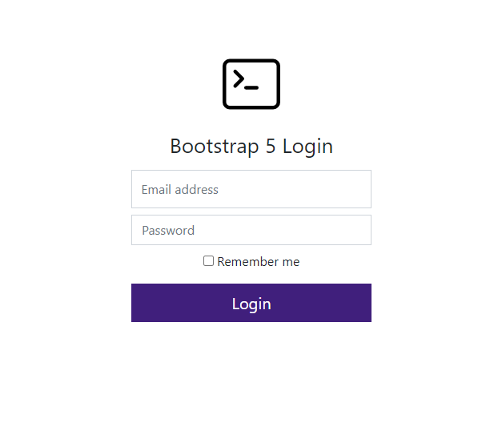

"# login-form-bootstrap5" 
# Description
Bootstrap 5 and sass login form example



## init
npm i bootstrap@5.0.0-alpha1

npm i bootstrap-icons

npm i popper.js

### vscode
plugin : "Live Sass Compiler

settings: liveSassCompile.settings.formats
```json
{
    "prettier.semi": false,
    "javascript.format.semicolons": "remove",
    "liveServer.settings.donotVerifyTags": true,
    "editor.formatOnSave": true,
    "liveSassCompile.settings.formats": [
        {
            "format": "expanded",
            "extensionName": ".css",
            "savePath": "/css"
        }
    ],
    "liveSassCompile.settings.generateMap": false,
    "liveSassCompile.settings.autoprefix": []
}
```

#webstorm


###Generate package json
do not run
npm init -y

